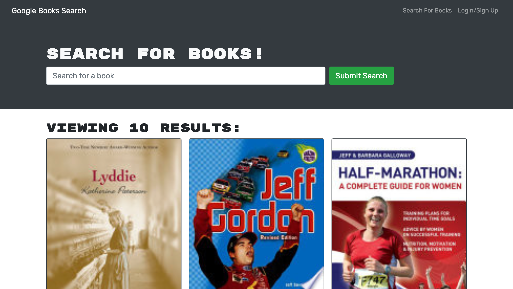
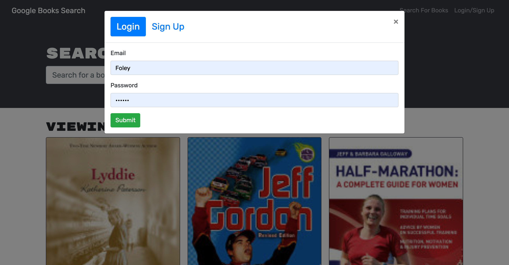

# Book Search Engine

## Overview

Book Search enginge is designed to help avid readers search for new books, and keep a list of books to purchase.

## Table of Contents

- [Functionality](#functionality)

- [Technologies](#technologies)

- [Screenshot](#screenshot)

- [Deployed Site](#deployedsite)

## Functionality

* When the site is loaded, users are presented with a menu with the options Search for Books and Login/Signup and an input field to search for books and a submit button.

* The Search for Books menu option presents an input field to search for books, and a submit button.

* If a user is not logged in and enters a search term in the input field (and clicks the submit button) they are presented with several search results, each featuring a book’s title, author, description, image, and a link to that book on the Google Books site.

* Clicking on the Login/Signup menu option causes a modal to appear on the screen with a toggle between the option to log in or sign up. When the toggle is set to Signup, the user is given inputs for username, email address, and a password- and a signup button.

* When a user sets the toggle to Login, they are presented with two inputs for an email address and a password- and login button. The user is required to provide a valid email address and create a password in order to click on the signup button. This creates the user account, closes the modal and logs them in to the site.

* Once logged in to the site, the menu options change to Search for Books, an option to see saved books, and Logout.

* When a user is logged in and enters a search term in the input field, then clicks the submit button, they are presented with several search results, each featuring a book’s title, author, description, image, and a link to that book on the Google Books site and a button to save a book to their account.

* The Save button on a book saves that book’s information to the user's account. The user can click on the option to see their saved books, and will be presented with all of the books they have saved to my account, each featuring the book’s title, author, description, image, and a link to that book on the Google Books site.

* The Remove button on a book deletes it from the saved books list

* When a user clicks on the Logout button, they are logged out of the site and presented with a menu with the options Search for Books and Login/Signup and an input field to search for books and a submit button.

## Deployed Site

Please visit the deployed site [here](https://follestad-book-search.herokuapp.com/).

## Screenshot

